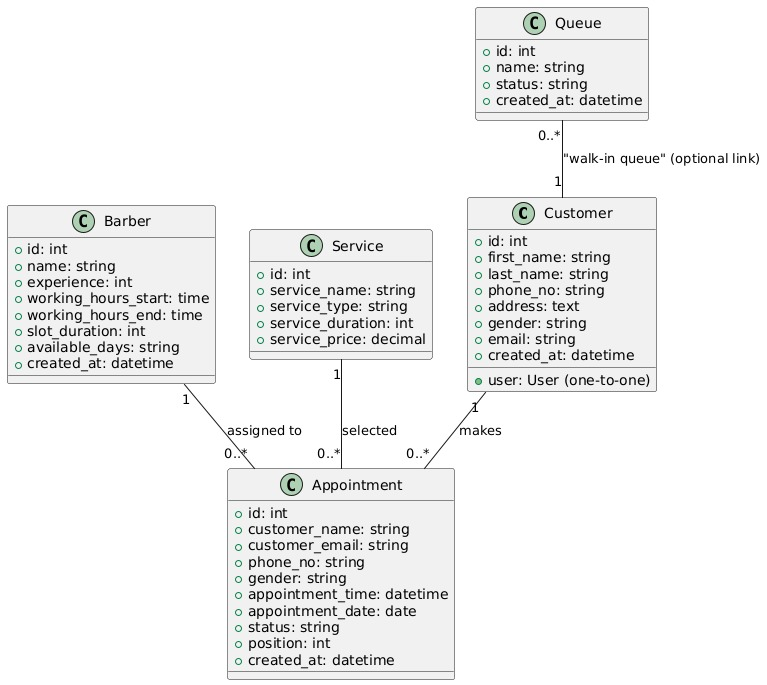

Below is an example README file (e.g., `UML_README.md`) that documents your data model. This document references the attached UML diagram image (`UML.jpg`) for a visual overview and then provides the full Django models code—including the relationships and key methods used in the project.

---

# UML and Models Documentation

This document describes the data model for the Barber Queue Management System. For a visual representation of the relationships between entities, please refer to the attached image:

.

Below, you will find the full code for each model along with explanations and methods implemented in the system.

---

## 1. Models and Relationships

### Customer

The **Customer** model stores details about clients. Although in our implementation the appointment records store the customer’s name and email directly, a full Customer model can be used to capture more detailed user information.

```python
from django.db import models
from django.contrib.auth.models import User

class Customer(models.Model):
    user = models.OneToOneField(User, on_delete=models.CASCADE, null=True, blank=True)
    first_name = models.CharField(max_length=100)
    last_name = models.CharField(max_length=100)
    phone_no = models.CharField(max_length=20, null=True, blank=True)
    address = models.TextField(null=True, blank=True)
    gender = models.CharField(max_length=10, null=True, blank=True)
    email = models.EmailField(unique=True)
    created_at = models.DateTimeField(auto_now_add=True)

    def __str__(self):
        return f"{self.first_name} {self.last_name}"
```

### Barber

A **Barber** can have multiple appointments. This one-to-many relationship is implemented via a `ForeignKey` in the `Appointment` model.

```python
class Barber(models.Model):
    name = models.CharField(max_length=100)
    experience = models.IntegerField(default=0)
    working_hours_start = models.TimeField(default="09:00")
    working_hours_end = models.TimeField(default="17:00")
    slot_duration = models.IntegerField(default=30)
    # For simplicity, available_days is stored as a comma-separated string.
    available_days = models.CharField(
        max_length=200,
        default="Monday,Tuesday,Wednesday,Thursday,Friday"
    )
    created_at = models.DateTimeField(auto_now_add=True)

    def __str__(self):
        return self.name
```

### Service

A **Service** represents an offering (e.g., Hair Styling, Shaving). A service may be used by many appointments, forming a one-to-many relationship.

```python
class Service(models.Model):
    service_name = models.CharField(max_length=100)
    service_type = models.CharField(max_length=100, null=True, blank=True)
    service_duration = models.IntegerField(default=30)
    service_price = models.DecimalField(max_digits=8, decimal_places=2, default=0.00)

    def __str__(self):
        return self.service_name
```

### Appointment

An **Appointment** represents a booking that links a customer (via stored fields), a barber, and optionally a service.  
It includes a method to calculate the position in the queue for pending appointments.

```python
class Appointment(models.Model):
    STATUS_CHOICES = (
        ('pending', 'Pending'),
        ('scheduled', 'Scheduled'),
        ('canceled', 'Canceled'),
        ('completed', 'Completed'),
    )
    customer_name = models.CharField(max_length=100)
    customer_email = models.EmailField()
    phone_no = models.CharField(max_length=20, null=True, blank=True)
    gender = models.CharField(max_length=10, null=True, blank=True)
    barber = models.ForeignKey(Barber, on_delete=models.CASCADE)
    service = models.ForeignKey(Service, on_delete=models.SET_NULL, null=True, blank=True)
    appointment_time = models.DateTimeField()
    appointment_date = models.DateField()
    status = models.CharField(max_length=20, choices=STATUS_CHOICES, default='pending')
    position = models.IntegerField(default=0)
    created_at = models.DateTimeField(auto_now_add=True)

    def __str__(self):
        return f"Appointment for {self.customer_name} on {self.appointment_date}"

    @classmethod
    def calculate_position(cls, appointment_date):
        """
        Calculate the next available position for a pending appointment on a given date.
        """
        pending_count = cls.objects.filter(appointment_date=appointment_date, status='pending').count()
        return pending_count + 1

    def save(self, *args, **kwargs):
        # If this is a new appointment and it's pending, calculate its position automatically.
        if self._state.adding and self.status == 'pending':
            self.position = Appointment.calculate_position(self.appointment_date)
        super().save(*args, **kwargs)
```

### Queue

The **Queue** model represents a walk-in queue. It stores the customer's name along with the status of their queue entry.

```python
class Queue(models.Model):
    STATUS_CHOICES = (
        ('pending', 'Pending'),
        ('canceled', 'Canceled'),
        ('completed', 'Completed'),
    )
    name = models.CharField(max_length=100)
    status = models.CharField(max_length=20, choices=STATUS_CHOICES, default='pending')
    created_at = models.DateTimeField(auto_now_add=True)

    def __str__(self):
        return f"{self.name} - {self.status}"
```

---

## 2. Relationship Explanations

- **Barber ---> Appointment (One-to-Many):**  
  Each `Appointment` references one `Barber` via a `ForeignKey`. If a barber is deleted, all related appointments are also deleted (cascade delete).

- **Service ---> Appointment (One-to-Many):**  
  An `Appointment` may reference one `Service` via a `ForeignKey`. With `on_delete=models.SET_NULL`, if a service is removed, the appointment’s service field is set to null.

- **Customer ---> Appointment (One-to-Many):**  
  Although the `Appointment` model stores customer details directly (as `customer_name`, `customer_email`, etc.), a more detailed implementation might use a `ForeignKey` to a `Customer` model.

- **Queue:**  
  The `Queue` model simply stores the name and status of a queue entry. It can be extended to reference a `Customer` if needed.

All relationships are implemented using Django’s ORM fields (`ForeignKey`, `OneToOneField`), and the business logic (e.g., calculating the queue position) is implemented through model methods.

---
